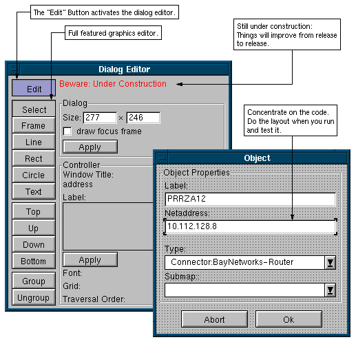

<div style="text-align: center"></div>
<div style="text-align: center">An experimental C++ library to create graphical user interfaces (GUIs) under the X11 windowing system</div>

<div style="text-align: center"></div>

TOAD <strike>is</strike> was...

* ...a C++ GUI Library for the X11&trade; window system and is released under the terms of the GNU LGPL 2.1.

* ...developed since 1995 and provides some interesting features but fails to compete with the manpower behind Gtk or Qt.

* ...the base for most applications hosted at mark13.org.

* ...not actively developed anymore.

* Version 2 was a port to MacOS X

* Version 3 is available here https://github.com/markandre13/toad.js and runs on the webcomponents.

# Features

The TOAD C++ GUI Library provides some standard features found in other GUI libraries like

* Model-View Architecture
* UTF-8 text encoding
* <strike>True color and color dithering on 4 to 8 bit display depths</strike>
* C++ Template based Signal &amp; Slot style callbacks

  Signal &amp; Slots is the name of the callback technique in the Qt C++ GUI library which requires an additional preprocessor while TOAD achieves the same with C++ templates.
  
  Experience shows that keeping track of callbacks in complex applications is too complicated so a new idea is <strike>to introduce a central database of callbacks.</strike> to use:

* Closures

  Well not real closures but closure alike constructs for callbacks.  The current implementation uses preprocessor macros and templates.
  
* Platform independent font specification via fontconfig

  (for both X11 and FreeType fonts)
  
* Pluggable Layout Managers (Spring layout, etc.)

* 2D vector graphic editor
* Postscript, PDF and SVG output (through the Cairo graphics library)
* high quality UTF-8 text rendering (through Gtk's Pango library)
* <strike>Minimal (crappy) HTML Viewer for Online Documentation</strike>

The following features are unique:

* Decoupled Menubar

  Methods and the menubar/toolbar are connected automatically over the window hierarchy.
  
  This not only simplifies the creation of menubars but also allows automatic handling of different menu styles like the single menubar under MacOS X or the typical one menubar per window under X11.
  
* Decoupled Undo Management

  Undo objects and undomangers/menubars are connected automatically over the window hierarchy.
  
* Runtime Layout Editor

  Layouts of dialogs, menubars, formlayouts, etc.  can be configured at runtime.
  
Other planned features are, for example, a C++ scripting language to create a complete User Interface Management System (UIMS) for Rapid Prototyping.

# Hello World

<div style="text-align: center;"></div>

This program subclasses the class <em>TMyWindow</em> from TOAD's window class <em>TWindow</em> and displays it.

The command <code>g++ `toad-config --cxxflags --libs` hello.cc</code> will compile the program.

```c++
// include declarations of TOAD basic classes
#include <toad.hh>

// use the TOAD namespace
using namespace toad;

// define a new window class, based on TWindow
class TMyWindow: public TWindow
{
  public:
  // typical constructor for windows
  TMyWindow(TWindow *parent, const string &title) :TWindow(parent, title) {}
  
  // define a new method to paint the windows content
  void paint() {
    // create a pen for this window and use it to...
    TPen pen(this);
    // ...draw a text at position (50, 50)
    pen.drawString(50, 50, "Hello World!!!");
  }
};

// initialize TOAD, create window and enter the message loop
int main(int argc, char **argv, char **envv) {
  // initialize TOAD library
  toad::initialize(argc, argv, envv);
  // create window
  TMyWindow *window = new TMyWindow(0, "Hello World");
  // show window and handle user input until window is closed
  toad::mainLoop();
  // the window has been closed so we dispose of the object
  delete window;
  // clean up TOAD
  toad::terminate();
  return 0;
}
```

# Dialog Editor

<div style="text-align: center; background: #999999;"></div>

The dialog editor is integrated into the library and can be used at runtime.

This was done because most ideas on how to fine tune the layout of a program come when one
actually <em>uses</em> the program.

## Step 1: Write the Code

```c++
#include <toad/toad.hh>
#include <toad/dialog.hh>
#include <toad/textfield.hh>
#include <toad/pushbutton.hh>

class TMyWindow: public TDialog {
  public:
    TMyWindow(TWindow *parent, const string &title);
    void printData();
    // the data we're going to edit
    TTextModel name, surname;
    TUnsignedModel age;
 };

int main(int argc, char **argv, char **envv) {
  toad::initialize(argc, argv, envv);
  {
    // tell TOAD where to store/read the resource files
    TOADBase::setResourcePrefix("file://resource/");
    TMyWindow(NULL, "MyWindow");
    
    // start the application
    toad::mainLoop();
  }
  toad::terminate();
  return 0;
}

TMyWindow::TMyWindow(TWindow *parent, const string &title):
  TDialog(parent, title)
{
  // create the widgets
  TTextField *tf;
  tf = new TTextField(this, "name", &name);
  tf = new TTextField(this, "surname", &surname);
  tf = new TTextField(this, "age", &age);
  TPushButton *pb;
  pb = new TPushButton(this, "print");
  CONNECT(pb->;sigActivate, this, printData);
  pb = new TPushButton(this, "quit");
  CONNECT(pb->sigActivate, this, closeRequest);
  
  // set a resource name for the layout\r\n
  doLayout("MyWindow");
}

void TMyWindow::printData() {
  // print the data
  cout << "Name   : " << name << endl
       << "Surname: " << surname << endl
       << "Age    : " << age << endl;
}
```

## Step 2: Execute your program

<div style="text-align: center;"></div>

<pre>make ./program --layout-editor</pre>

When no earlier layout exists all the widgets are placed in the upper left corner of the window.

## Step 3: Layout your widgets

<div style="text-align: center;"></div>

Enable the layout editor and use the mouse to move and resize the widgets.  You can even add additional graphical elements.

The dialog editor used here is named "TDialogLayout", which is the default for dialog windows.  But one can easily use other layout algorithms, for example TSpringLayout.

## Step 4: Fin

<div style="text-align: center;"></div>

Once the layout is finished you can save the layout.

# Signals and Callbacks

GUI applications are event driven, eg.  the user pushes a button and an email is sent.  The common way to do this is to create a TPushButton object and to instruct it to call you back when is was pushed:

```c++
class TMailApplication:
  public TWindow
{
  public:
    TMailApplication() {
      ...
      // create a pushbutton and...
      TPushButton *btn = new TPushButton(this, "Send email");
      // ...and tell it to call 'this->sendMail()' when it is pushed
      CONNECT(btn->sigClicked, this, sendMail);
    }
    
    void sendMail() {
      cout << "calling 'sendmail'" << endl;
      ...
    }
};
```

The following happens here:

* TPushButton contains an object named <em>sigClicked</em> of type TSignal.  Each time TPushButton thinks that it was pushed, it calls <em>sigClicked.trigger()</em> which in turn calls all functions which were connected to it.

  In the example above the method <em>sendMail()</em> would be called.
  
  * CONNECT is a C pre-processor macro which utilises the GNU C Compilers 'typeof' operator to make the syntax a little bit more neat.  When you don't want to rely on the existence of the 'typeof' operator, you may also write:
  
  connect(btn->sigClicked, this, &TMailApplication::sendMail);
  
Below are some more examples to get the feel of it.

A feature which do I consider extremly <em>cool</em> is the TCLOSURE macro below.  It mimics SmallTalk closures and allows you to write the code to be called back at the same place where you connect it to TSignal.

```c++
#include <toad/connect.hh>
struct TMySource {
  TSignal sigAction;
  int value;
  int getValue() { return value; }
};

struct TMyDestination {
  void doIt(int n) { cout << "doIt: " << n << endl; }
};

int main() {
  TMySource *source = new TMySource();
  source->value = 42;
  TMyDestination *destination = new TMyDestination();
  // ANSI C+ compatible call interface
  //^^^^^^^^^^^^^^^^^^^^^^^^^^^^^^^^^^^^^^^^^^^^^^^^^^^^^^^^^^^^^^^^^
  connect(
    source->sigAction,                   // when triggered
    destination, &TMyDestination::doIt); // call method

  connect_value_of(
    source->sigAction,                   // when triggered
    destination, &TMyDestination::doIt,  // call method
    source, &TMySource::getValue);       // with the return value of method

  connect_value_of(
    source->sigAction,                   // when triggered
    destination, &TMyDestination::doIt,  // call method
    &source->value);                     // with the return value of variable

  connect_value(
    source->sigAction,                   // when triggered
    destination, &TMyDestination::doIt,  // call method
    source);                             // with the return value of 'getValue()'
    
  // GNU C++ compatible call interface\r\n
  //^^^^^^^^^^^^^^^^^^^^^^^^^^^^^^^^^^^^^^^^^^^^^^^^^^^^^^^^^^^^^^^^^
  CONNECT(
    source->sigAction,                   // when triggered
    destination, doIt);                  // call method

  CONNECT_VALUE_OF(
    source->sigAction,                   // when triggered
    destination, doIt,                   // call method
    source, getValue());                 // with the return value of method
    
  CONNECT_VALUE(
    source->sigAction,                   // when triggered
    destination, doIt,                   // call method
    source);                             // with the return value of 'getValue()'
    
  TCLOSURE2(                             // closure with two variables
    source->sigAction,                   // the signal
    dst, destination,                    // dst := destination
    src, source,                         // src := source
    dst->doIt(src->getValue()*10);       // and execute this code
  )

  // triggering a signal
  //^^^^^^^^^^^^^^^^^^^^^^^^^^^^^^^^^^^^^^^^^^^^^^^^^^^^^^^^^^^^^^^^^
  source->sigAction();
  
  // disconnecting a signal
  //^^^^^^^^^^^^^^^^^^^^^^^^^^^^^^^^^^^^^^^^^^^^^^^^^^^^^^^^^^^^^^^^^
  disconnect(source->sigAction);         // remove all links
}
```
